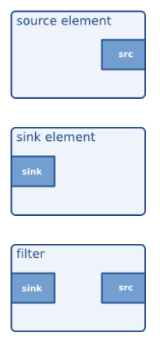

# DeepStream_projects
 projects to learn NVIDIA Deepstream SDK

#  GStreamer
GStreamer stands out as a robust and flexible framework for crafting streaming applications. Its strength lies in its modularity, allowing easy integration of new plug-in modules. However, while this modularity enhances functionality, it can also introduce complexity, making the development of new applications a less straightforward process.

# Theory

# Building an Application

<gst/gst.h> give you a acces to most library functions by simply including  including them, except the costomized APIs that require separate header files.

In addition, in order to be able to call the GStreamer library, the gst_init(&argc, &argv) function must be called in the main program to complete the necessary initialization work as well as the parsing of command line arguments.

**Elements**: are the building blocks of GStreamer pipelines. There are three main types of elements in a GStreamer pipeline: source elements, filter elements, and sink elements. Source elements produce data, filter elements transform or modify data, and sink elements consume data.



## Creating GstElement
```cpp
gst_init(&argc, &argv);

GstElement* element;
element = gst_element_factory_make("factory name", "unique element name")

// or
GstElementFactory* factory;
GstElement* element;
factory = gst_element_factory_find("factory name")
element = gst_element_factory_create(factory, "unique element name")
```
## Using an element as a GObject

A GstElement can have some properties, which are implemented using standard GObject properties. Each GstElement inherits at least the "name" attribute of GObject, which is the "unique element name" passed when creating the GstElement. GObject provides setters and getters for common properties, but a more general approach is to use ```g_object_set/get```.

```cpp
//setter
g_object_set(G_OBJECT(element), "propeety name", &value, NULL)
//getter
g_object_get(G_OBJECT(element), "propeety name", &value, NULL)
```

For attribute query, GStreamer provides **gst-inspect-1.0** tools for querying the attributes and simple description of the specified element.

The most important feature of GstElementFactory is that it has a complete description of the pads supported by the plugin it belongs to, without actually loading the element into memory.

## Link Elements
The connection of two elements is actually a negotiation between **src-pad** and **sink-pad**, so the connection requires that the caps of the two pads have intersection and that the elements are in the same GstBin.

```cpp
gst_element_link();
gst_elemenet_link_many();
gst_element_link_pads();
```

## Element States
GStreamer elements have only four states.

**`GST_STATE_NULL`:** Default state where no resources are applied. When the reference count of an element becomes 0, it must be in the NULL state. Switching to this state from any other state will release all applied resources.

**`GST_STATE_READY`:** In this state, the element applies relevant global resources without involving stream data. In short, transitioning from NULL to READY opens the related hardware device and applies buffers, while transitioning from PLAYING to READY stops reading stream data.

**`GST_STATE_PAUSE`:** This state is the most common in GStreamer. At this stage, the pipeline opens the stream but doesn't process it. For example, a sink element reads the first frame of the video file and is ready to play.

**`GST_STATE_PLAYING`:** There is no real difference between the PLAYING and PAUSE states, except that PLAYING allows the clock to run.

Normally, setting the state of a bin or pipeline element will automatically switch the state of all the elements it contains. However, if you dynamically add an element to a pipeline in the PLAYING state, you need to manually switch the state of that element.


## GstBin:

A `GstBin` in GStreamer can amalgamate a sequence of elements into a logical element, facilitating the control and management of these elements as a cohesive unit. The outermost bin in this hierarchy is referred to as the pipeline. `GstBin` manages the state of its internal elements.

## GstBus:

`GstBus` in GStreamer serves as a system for relaying messages from the stream thread to application threads. While the `GstBus` operates within the application's context, it can seamlessly monitor threads within the GStreamer framework.

Every pipeline is equipped with its own `GstBus`, and developers are only required to establish a handler to manage messages appropriately upon reception.


```ccp
#include <gst/gst.h>

static GMainLoop *loop;

static gboolean
my_bus_callback (GstBus * bus, GstMessage * message, gpointer data)
{
  g_print ("Got %s message\n", GST_MESSAGE_TYPE_NAME (message));

  switch (GST_MESSAGE_TYPE (message)) {
    case GST_MESSAGE_ERROR:{
      GError *err;
      gchar *debug;

      gst_message_parse_error (message, &err, &debug);
      g_print ("Error: %s\n", err->message);
      g_error_free (err);
      g_free (debug);

      g_main_loop_quit (loop);
      break;
    }
    case GST_MESSAGE_EOS:
      /* end-of-stream */
      g_main_loop_quit (loop);
      break;
    default:
      /* unhandled message */
      break;
  }

  /* we want to be notified again the next time there is a message
   * on the bus, so returning TRUE (FALSE means we want to stop watching
   * for messages on the bus and our callback should not be called again)
   */
  return TRUE;
}

gint
main (gint argc, gchar * argv[])
{
  GstElement *pipeline;
  GstBus *bus;
  guint bus_watch_id;

  /* init */
  gst_init (&argc, &argv);

  /* create pipeline, add handler */
  pipeline = gst_pipeline_new ("my_pipeline");

  /* adds a watch for new message on our pipeline's message bus to
   * the default GLib main context, which is the main context that our
   * GLib main loop is attached to below
   */
  bus = gst_pipeline_get_bus (GST_PIPELINE (pipeline));
  bus_watch_id = gst_bus_add_watch (bus, my_bus_callback, NULL);
  gst_object_unref (bus);

  /* [...] */

  /* create a mainloop that runs/iterates the default GLib main context
   * (context NULL), in other words: makes the context check if anything
   * it watches for has happened. When a message has been posted on the
   * bus, the default main context will automatically call our
   * my_bus_callback() function to notify us of that message.
   * The main loop will be run until someone calls g_main_loop_quit()
   */
  loop = g_main_loop_new (NULL, FALSE);
  g_main_loop_run (loop);

  /* clean up */
  gst_element_set_state (pipeline, GST_STATE_NULL);
  gst_object_unref (pipeline);
  g_source_remove (bus_watch_id);
  g_main_loop_unref (loop);

  return 0;
}
```


https://deci.ai/blog/build-deepstream-pipeline/
https://deci.ai/blog/identify-bottlenecks-nvidia-deepstream-pipeline/